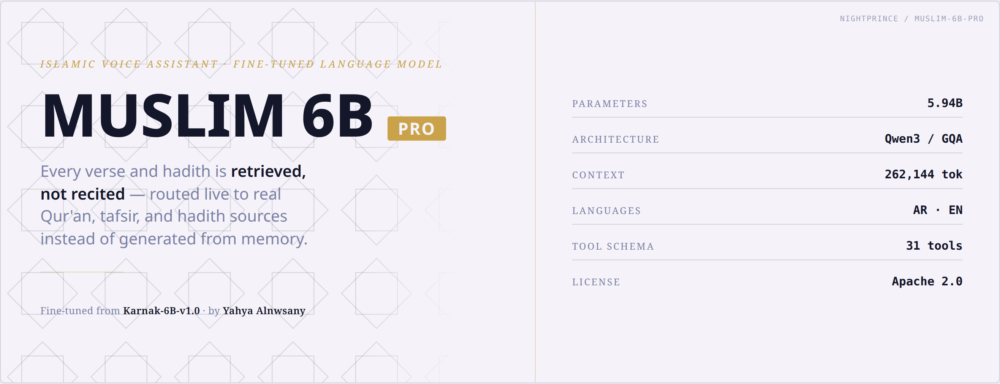

<p align="center">
  
</p>

# Muslim-6B-PRO — Fine-Tuning

QLoRA fine-tuning of **Karnak-6B** (`Applied-Innovation-Center/Karnak-6B-v1.0`) into
**Muslim-6B-PRO**, the reasoning core of **مُسلِم** (Muslim), an Arabic/English Islamic voice
assistant.

## What this is

A behavior-tuned LoRA — trained on **behavior, not facts**:

- **Tool routing** — call the right tool (`get_tafsir_verse`, `play_ayah`, `search_hadith`, and
  28 others across the Qur'an/hadith/tafsir/fatwa toolset) instead of answering from memory
- **Scripture guardrail** — never recite Qur'an or hadith text from weights; always route to
  audio/lookup tools
- **Persona & identity** — self-identifies as «مُسلِم», resists adversarial attempts to override
  its identity or scope
- **Scope discipline** — a one-line redirect for off-topic requests
- **Measured rulings** — calm, sourced responses on fiqh; appropriate hedging on contested points
- **Calibrated general knowledge** — Seerah, stories of the prophets, aqeedah, akhlaq, history,
  and comparative/interfaith framing, with no dedicated retrieval tool needed
- **TTS-clean output** — no digits, markdown, or stray Latin in spoken Arabic responses

Facts requiring exact, source-cited text (Qur'an wording, hadith matn/isnad, tafsir attribution)
are supplied at inference by real tool calls — never memorized into the weights, because language
models reliably hallucinate scripture when asked to recite it directly.

## Model output

**[NightPrince/Muslim-6B-PRO](https://huggingface.co/NightPrince/Muslim-6B-PRO)** — the merged,
publish-ready model.
**[NightPrince/Muslim-6B-PRO-GGUF](https://huggingface.co/NightPrince/Muslim-6B-PRO-GGUF)** —
GGUF quantizations (Q2_K through Q8_0, plus F16) for local inference via `llama.cpp`.

## Base model

[Applied-Innovation-Center/Karnak-6B-v1.0](https://huggingface.co/Applied-Innovation-Center/Karnak-6B-v1.0)
— a Qwen3-based Arabic LLM depth-extended to 5.94B parameters (54 layers, vocab 192,728),
Apache-2.0 license.

## Repo structure

```
dataset/
  muslim_lora_train_v4.jsonl       # final training split (2,513 examples)
  muslim_lora_val_v4.jsonl         # held-out validation split (218 examples)
  build_lora_dataset_v4.py         # deterministic dataset builder
  merge_dspark_conversations.py    # ground-truth-checked real tool-augmented conversations
  merge_voice_sessions.py          # ground-truth-checked real production voice-session turns
  verify_surah_facts.py            # independent fact-check gate for every surah/ayah claim
  validate_dataset.py              # schema / TTS-clean / dedup checks
  DATACARD_V4.md                   # full dataset provenance and behavior budget

train/
  sft_lora.py                      # main training script (TRL SFTTrainer, QLoRA)
  karnak_training_chat_template.jinja  # patched template with  markers
  merge_and_push.py                # merge LoRA into base, optionally push to HF Hub
  generate_model_card.py           # generates the model card from real trainer_state.json metrics
  delete_old_versions.py           # cleanup for superseded HF repos
  MODEL_CARD_PRO.md                # the published model card

eval/
  run_eval_gate.py                 # eval gate runner (base vs base+LoRA probe comparison)
  probe_prompts.py / _v2.py / _v4.py   # 57 probes across all behavior categories

assets/identity/
  muslim-6b-pro-banner-{light,dark}.png  # horizontal identity poster
  muslim-6b-pro-icon.png                 # square mark
  muslim-6b-pro-social-card.png          # 1280x640 social preview card

watchdog.sh / watchdog_check_once.sh
  Auto-recovery for the training process if it dies without a full host restart
  (observed during this project as a connection-layer issue, not a training bug).
```

## Training setup

- **Hardware:** RTX 2080 Ti (Turing, SM75, 11 GB) — fp16 only, no bf16
- **Method:** QLoRA 4-bit NF4, LoRA r=16 α=32 dropout=0.05, 3 epochs, lr=2e-4 cosine schedule
- **Target modules:** `q_proj k_proj v_proj o_proj gate_proj up_proj down_proj`
- **Dataset:** 2,731 examples (2,513 train / 218 val), 59% tool-calling traces
- **Best checkpoint:** selected via `load_best_model_at_end` on held-out eval loss across the
  full 3-epoch run, not simply the final step

## Eval gate

The behavioral probe suite (`eval/probe_prompts.py` + `_v2.py` + `_v4.py`, 57 probes covering
tool-routing, adversarial identity pressure, alt-surah-name resolution, and held-out
generalization) is the actual quality gate — loss curves alone don't catch tool-routing or
persona regressions. A full run is pending publication; see the [model card](https://huggingface.co/NightPrince/Muslim-6B-PRO)
for current status.

## Creator

**يحيى النوساني** (Yahya Alnwsany)
