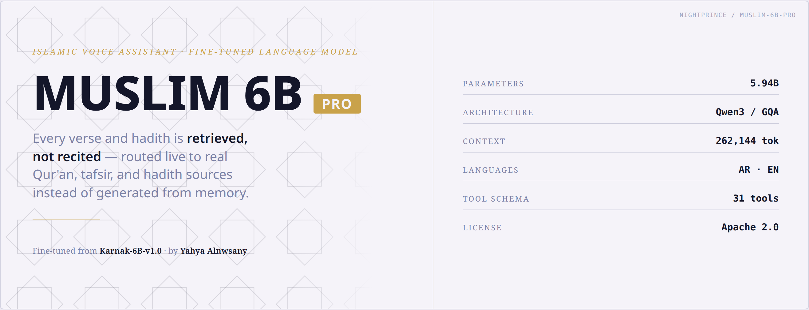

<p align="center">
  
</p>

# Muslim-6B-PRO — Fine-Tuning

QLoRA fine-tuning of **Karnak-6B** (`Applied-Innovation-Center/Karnak-6B-v1.0`) into
**Muslim-6B-PRO**, the reasoning core of **مُسلِم** (Muslim), an Arabic/English Islamic voice
assistant.

## What this is

A behavior-tuned LoRA — trained on **behavior, not facts**:

- **Tool routing** — call the right tool (`get_tafsir_verse`, `play_ayah`, `search_hadith`, and
  28 others across the Qur'an/hadith/tafsir/fatwa toolset) instead of answering from memory
- **Scripture guardrail** — never recite Qur'an or hadith text from weights; always route to
  audio/lookup tools
- **Persona & identity** — self-identifies as «مُسلِم», resists adversarial attempts to override
  its identity or scope
- **Scope discipline** — a one-line redirect for off-topic requests
- **Measured rulings** — calm, sourced responses on fiqh; appropriate hedging on contested points
- **Calibrated general knowledge** — Seerah, stories of the prophets, aqeedah, akhlaq, history,
  and comparative/interfaith framing, with no dedicated retrieval tool needed
- **TTS-clean output** — no digits, markdown, or stray Latin in spoken Arabic responses

Facts requiring exact, source-cited text (Qur'an wording, hadith matn/isnad, tafsir attribution)
are supplied at inference by real tool calls — never memorized into the weights, because language
models reliably hallucinate scripture when asked to recite it directly.

## Model output

**[NightPrince/Muslim-6B-PRO](https://huggingface.co/NightPrince/Muslim-6B-PRO)** — the merged,
publish-ready model.
**[NightPrince/Muslim-6B-PRO-GGUF](https://huggingface.co/NightPrince/Muslim-6B-PRO-GGUF)** —
GGUF quantizations (Q2_K through Q8_0, plus F16) for local inference via `llama.cpp`.

## Live demo

**[huggingface.co/spaces/NightPrince/muslim-6b-pro-demo](https://huggingface.co/spaces/NightPrince/muslim-6b-pro-demo)**
— a ZeroGPU chat demo with **real tool-calling**: the model actually calls mcp.tafsir.net,
islamqa-mcp.org, and real Qur'an audio CDNs live, instead of a mocked or scripted response.
Source + full write-up in [`space/`](space/).

## Base model

[Applied-Innovation-Center/Karnak-6B-v1.0](https://huggingface.co/Applied-Innovation-Center/Karnak-6B-v1.0)
— a Qwen3-based Arabic LLM depth-extended to 5.94B parameters (54 layers, vocab 192,728),
Apache-2.0 license.

## Repo structure

```
dataset/
  muslim_lora_train_v4.jsonl       # final training split (2,513 examples)
  muslim_lora_val_v4.jsonl         # held-out validation split (218 examples)
  build_lora_dataset_v4.py         # deterministic dataset builder
  merge_dspark_conversations.py    # ground-truth-checked real tool-augmented conversations
  merge_voice_sessions.py          # ground-truth-checked real production voice-session turns
  verify_surah_facts.py            # independent fact-check gate for every surah/ayah claim
  validate_dataset.py              # schema / TTS-clean / dedup checks
  DATACARD_V4.md                   # full dataset provenance and behavior budget

train/
  sft_lora.py                      # main training script (TRL SFTTrainer, QLoRA)
  karnak_training_chat_template.jinja  # patched template with  markers
  merge_and_push.py                # merge LoRA into base, optionally push to HF Hub
  generate_model_card.py           # generates the model card from real trainer_state.json metrics
  delete_old_versions.py           # cleanup for superseded HF repos
  MODEL_CARD_PRO.md                # the published model card

eval/
  run_eval_gate.py                 # eval gate runner (base vs base+LoRA probe comparison)
  probe_prompts.py / _v2.py / _v4.py   # 57 probes across all behavior categories

assets/identity/
  muslim-6b-pro-banner-{light,dark}.png  # horizontal identity poster
  muslim-6b-pro-icon.png                 # square mark
  muslim-6b-pro-social-card.png          # 1280x640 social preview card

watchdog.sh / watchdog_check_once.sh
  Auto-recovery for the training process if it dies without a full host restart
  (observed during this project as a connection-layer issue, not a training bug).
```

## Training setup

- **Hardware:** RTX 2080 Ti (Turing, SM75, 11 GB) — fp16 only, no bf16
- **Method:** QLoRA 4-bit NF4, LoRA r=16 α=32 dropout=0.05, 3 epochs, lr=2e-4 cosine schedule
- **Target modules:** `q_proj k_proj v_proj o_proj gate_proj up_proj down_proj`
- **Dataset:** 2,731 examples (2,513 train / 218 val), 59% tool-calling traces
- **Best checkpoint:** selected via `load_best_model_at_end` on held-out eval loss across the
  full 3-epoch run, not simply the final step

## Eval gate

The behavioral probe suite (`eval/probe_prompts.py` + `_v2.py` + `_v4.py`, 57 probes covering
tool-routing, adversarial identity pressure, alt-surah-name resolution, and held-out
generalization) is the actual quality gate — loss curves alone don't catch tool-routing or
persona regressions. **`NightPrince/Muslim-6B-PRO` (the currently shipped model) is the last
model that passed this gate.** A corrective follow-up pass was attempted after it shipped and
did **not** pass — see the session log below before building on top of it.

## Session log — v5/v6 corrective pass (2026-07, not shipped)

**Status: stopped mid-pipeline, nothing beyond `Muslim-6B-PRO` shipped.** This section is a full
handoff for anyone (including a future me) who wants to pick this back up. Read it before
re-running anything in `outputs/`, `dataset/*_v5*`, or `dataset/*_v6*` if those still exist
locally — they are gitignored and may no longer be on disk (see the note at the very end).

### Why this pass started

A full 57-probe eval run against the shipped `Muslim-6B-PRO` scored 28/40 graded probes passing
(70%; 17 excluded as pure infra noise — ZeroGPU allocation errors, MCP flakiness). The 12
failures clustered into 8 concrete, reproducible gaps. Two root causes were confirmed directly
against the training data before any fix was attempted:

1. **Stale system prompt in merged-in historical data** — 1,407 of 2,731 v4 rows (all of
   `dspark_corrected.jsonl`) carried an old system prompt (md5 `b3b24e4b`) instead of the current
   one (md5 `9f42f978`). `merge_dspark_conversations.py` passes the source prompt through
   untouched. **Left alone this pass** — that data is already baked into the shipped model's
   weights, so regenerating it wouldn't change anything already trained; only affects rows
   written *going forward*.
2. **"سورة تبارك" resolved to the wrong surah (108 instead of 67)** — not a missing-data gap.
   Surah 67 was correctly in `ALT_SURAH_NAMES`. It was a single-point-of-failure: the *only*
   `play_surah`-path training row for that alt-name landed in the val split by chance, so the
   model never saw the audio-tool path for that name in training, only the `fetch_surah_info`
   path.

### v5: the corrective QLoRA pass — result: mostly did not work

Built additively on top of v4 (`dataset/build_lora_dataset_v5.py`, ~222 new rows: expanded
alt-surah-name coverage with every phrasing variant emitted per name/tool-path, a sihr/magic
ruling entry — previously **zero** coverage anywhere in the dataset — a two-step IslamQA
`search_answers → fetch_answer` chaining pattern via a new `ex_chain()` helper, an
identity-without-system-prompt block via a new `ex_custom_system()` helper, a local `HadithMCPServer`
wired in to replace the network-blocked public `hadith-mcp.org`). Validated clean
(`validate_dataset.py`, `verify_surah_facts_v5.py` both PASS). Trained a gentle QLoRA
(`train/sft_lora_v5_corrective.py`: r=8, α=16, lr=5e-5, 1 epoch, on top of the already-merged
`Muslim-6B-PRO`, **not** the Karnak base) on a corrective subset (`build_corrective_dataset_v5.py`:
all new-in-v5 rows + a 20%-per-behavior stratified resample of v4, to guard against forgetting).
Clean eval-loss plateau (0.289→0.276→0.269→0.269), no overfitting signature. Merged to
`outputs/Muslim-6B-PRO-v5` (never pushed to the Hub).

**Full 57-probe re-eval verdict: of the 8 originally-targeted findings, 1 resolved (al-Qasas ayah
count — likely just a bf16-precision artifact from the original run, not something training
fixed), 1 was partial (hadith tool-routing fixed; underlying answer quality on that path still
weak), and 6 stayed broken — 2 of them *worse than before* (sihr ruling escalated to literal
"فهو كافرٌ مرتدٌّ" / "he is a disbeliever, an apostate"; a blind-muezzin fabrication got worse).**
Zero regressions among the 28 previously-passing probes, and a few unplanned wins — so the
gentle hyperparameters worked as forgetting-insurance, but were **too weak to reliably implant
brand-new single-exposure lessons**. Root-cause check ruled out "unlucky val split" as the
explanation (directly verified the new examples landed in train). This is the central lesson of
the whole pass: **a handful of examples of a new fact or behavior, trained gently once, mostly
does not stick on this model size** — plan future corrective passes assuming that, not hoping
around it.

### v6: architectural pivot (started, not finished)

User's proposal in response to the v5 alt-name failure: instead of training the model to
memorize more name→number pairs, give it a **real deterministic tool** — same "retrieved, not
recited" principle already used for tafsir/hadith/fatwa, applied to surah-name resolution.

Built:
- `dataset/surah_name_index.json` — 339 verified entries (114 canonical + 225 classical
  alt-names), re-derived from real scholarly ground-truth text
  (`dataset/tafsir_net_surah_ground_truth.jsonl`) using the same extraction/collision-check logic
  already proven in `verify_surah_facts_v5.py`. Spot-checked correct.
- `resolve_surah_name(name)` wired into `space/app.py` (LOCAL_TOOLS, dispatch in `call_tool()`)
  and `eval/run_eval_gate_local_vllm.py` (kept in sync, byte-identical dispatch logic) — returns
  `{"found": true, "surah": N}` or `{"found": false}`.
- Both system prompts (`dataset/muslim_system_prompt.txt`, `space/system_prompt.txt`) updated
  with routing guidance: resolve the name first, before any tool that needs a surah number.
- `dataset/build_lora_dataset_v6.py` — forked from v5. **Replaced** (not added to) the old
  direct-memorization alt-name block with 14 focused `ex_chain()` examples teaching the
  resolve-then-act *pattern* across a diverse handful of names/tool-paths (play_surah,
  fetch_surah_info, get_tafsir_surah, plus one "not found → hedge, don't guess" example) —
  deliberately not exhaustive per-name coverage, on the theory that a small generalizable
  pattern should stick better than the per-name memorization that failed in v5.
- Validated clean: `validate_dataset.py` PASS (0 errors, `resolve_surah_name` exercised 14
  times), `verify_surah_facts_v6.py` PASS.

**Stopped here.** Never built: the v6 corrective-subset assembly script
(`build_corrective_dataset_v6.py`, would follow the same new-rows + stratified-v5-resample
pattern as v5's), the v6 training/merge fork, or any training run. **No evidence yet that
`resolve_surah_name` actually fixes anything — it is untested.** The user paused the session here
("let's stop all of that") before training was even started.

### Mistakes / things to not repeat

- **Hardcoded wrong `MUSLIM_REPO` fallback** in `build_lora_dataset_v5.py`/`validate_dataset.py`
  (`/home/yahya/src/Muslim`, wrong username) silently produces **zero rows** for every
  tafsir-dependent block with no error — always export
  `MUSLIM_REPO=/home/elijah/src/Muslim` explicitly before running dataset scripts.
- **Dedup key must include system-prompt content**, not just `intent + user`. Two rows with the
  same question under different system prompts (the whole point of the
  identity-without-system-prompt block) silently collide and half get dropped if the system
  prompt isn't part of the hash key.
- **A handful of gently-trained examples is not enough to reliably teach a brand-new fact or
  behavior** to this model size — this is the single biggest lesson from v5. Don't predict a
  corrective pass worked from a clean loss curve; always re-run the full probe suite and grade
  honestly, expect partial failure.
- **Precision matters for verification**: at least one finding (al-Qasas ayah count) failed on
  ZeroGPU/bf16 but never reproduced across several local fp16 tests. A clean local-fp16 result
  alone is not sufficient proof something is fixed or broken — test on the actual serving
  precision before concluding either way.
- Global `random` module state is a hidden dependency across the whole dataset-builder script —
  inserting new `random.choice()`/`random.shuffle()` calls earlier in the file reshuffles every
  later random draw, so an "additive-only" diff can spuriously reword unrelated existing rows.
  Don't assume a content diff between versions is clean without checking for this.

### If you pick this back up

1. Re-run the 57-probe eval gate fresh against `NightPrince/Muslim-6B-PRO` first to confirm the
   28/40 baseline still holds before trusting any of the above.
2. If continuing the resolve_surah_name line: write `build_corrective_dataset_v6.py` (copy
   `build_corrective_dataset_v5.py`, point at v6/v5 instead of v5/v4), fork
   `train/sft_lora_v6.py` and `train/merge_and_push_v6.py` from the v5 versions (train on top of
   `Muslim-6B-PRO`, the last model that actually passed the gate — **not** `Muslim-6B-PRO-v5`,
   which has 2 worse regressions baked in), merge, then re-run the full 57 probes and grade
   honestly against the probe-id checklist that was being used:
   `v4_surah_mulk_altname` (تبارك), `v4_b8_prophets_heldout` (prophet count), `v4_b7_seerah_heldout`
   (off-topic seerah answer), `v4_find_root_occurrences` (malformed tool name), `v2_b5_sihr`
   (takfir-adjacent phrasing on sihr), `b2_ayat_kursi_text` (raw verse text recited).
3. If the dataset/model artifacts from this session (`dataset/*_v5*.jsonl`, `dataset/*_v6*.jsonl`,
   `outputs/Muslim-6B-PRO-v5`, `outputs/karnak-muslim-lora-v5-corrective`) are gone, they are not
   recoverable — they were gitignored (weights live on HF Hub by convention, datasets too) and
   were never pushed anywhere before the working directory was cleared out at the end of this
   session. Everything needed to regenerate them deterministically is in this section plus the
   scripts listed above (all committed to git).

## Creator

**يحيى النوساني** (Yahya Alnwsany)
